# System Documentation: {{system_name}}

> Generated by PRISM-KAD-TDS-MAU v1.1
> Date: {{date}}

---

## 1. Documentation Framework

### 1.1 Knowledge Map

```mermaid
mindmap
  root([{{system_name}} Knowledge Map])
    Purpose & Scope
      {{problem_addressed}}
      {{target_users}}
      {{key_capabilities}}
    System Architecture
      {{component_1}}
      {{component_2}}
      {{component_3}}
    Core Functionality
      {{function_area_1}}
      {{function_area_2}}
      {{function_area_3}}
    Technical Implementation
      {{technologies}}
      {{algorithms}}
      {{data_structures}}
    User Interaction
      {{workflows}}
      {{interfaces}}
      {{use_cases}}
```

### 1.2 Audience Analysis

| Audience | Information Needs | Technical Level | Documentation Focus |
|----------|-------------------|-----------------|---------------------|
| Developers | Implementation details, APIs, architecture | High | Technical specifications, code examples, integration guides |
| Researchers | Algorithms, methods, theoretical foundations | High | Detailed explanations, models, evaluation metrics |
| End-Users | Functionality, workflows, troubleshooting | Variable | Task-oriented guides, tutorials, FAQs |

### 1.3 Documentation Structure

```mermaid
graph TD
    A[Documentation Root] --> B[Introduction]
    A --> C[System Architecture]
    A --> D[Functionality Guide]
    A --> E[Technical Reference]
    A --> F[User Guide]
    A --> G[Appendices]

    B --> B1[Purpose & Overview]
    B --> B2[Key Features]
    B --> B3[Getting Started]

    C --> C1[Architecture Overview]
    C --> C2[Component Details]
    C --> C3[Integration Points]

    D --> D1[Core Functionality]
    D --> D2[Advanced Features]
    D --> D3[Use Cases]

    E --> E1[Technical Specifications]
    E --> E2[API Reference]
    E --> E3[Implementation Details]

    F --> F1[Installation Guide]
    F --> F2[Basic Usage]
    F --> F3[Troubleshooting]

    G --> G1[Glossary]
    G --> G2[FAQ]
    G --> G3[Resources]
```



---

## 2. Complete System Documentation

### 2.1 Introduction

#### 2.1.1 Purpose & Overview

{{purpose_overview}}

#### 2.1.2 Key Features

{{key_features}}

#### 2.1.3 Getting Started

{{getting_started}}

---

### 2.2 System Architecture

#### 2.2.1 Architecture Overview

```mermaid
flowchart TD
    {{architecture_diagram}}
```

{{architecture_description}}

#### 2.2.2 Component Details

{{component_details}}

#### 2.2.3 Integration Points

{{integration_points}}

---

### 2.3 Functionality Guide

#### 2.3.1 Core Functionality

{{core_functionality}}

#### 2.3.2 Advanced Features

{{advanced_features}}

#### 2.3.3 Use Cases

{{use_cases_detailed}}

---

### 2.4 Technical Reference

#### 2.4.1 Technical Specifications

{{technical_specifications}}

#### 2.4.2 API Reference

{{api_reference}}

#### 2.4.3 Implementation Details

{{implementation_details}}

---

### 2.5 User Guide

#### 2.5.1 Installation Guide

{{installation_guide}}

#### 2.5.2 Basic Usage

{{basic_usage}}

#### 2.5.3 Troubleshooting

{{troubleshooting}}

---

### 2.6 Appendices

#### 2.6.1 Glossary

{{glossary}}

#### 2.6.2 FAQ

{{faq}}

#### 2.6.3 Additional Resources

{{additional_resources}}

---

## 3. Documentation Delivery Notes

### 3.1 Version Information

- **Documentation Version:** {{doc_version}}
- **System Version Covered:** {{system_version}}
- **Last Updated:** {{date}}

### 3.2 Using This Documentation

Navigate this documentation based on your role:
- **Developers:** Start with Section 2.2 (Architecture) and 2.4 (Technical Reference)
- **Researchers:** Focus on Section 2.3 (Functionality) and 2.4 (Technical Reference)
- **End-Users:** Begin with Section 2.1 (Introduction) and 2.5 (User Guide)

### 3.3 Feedback and Updates

{{feedback_info}}
